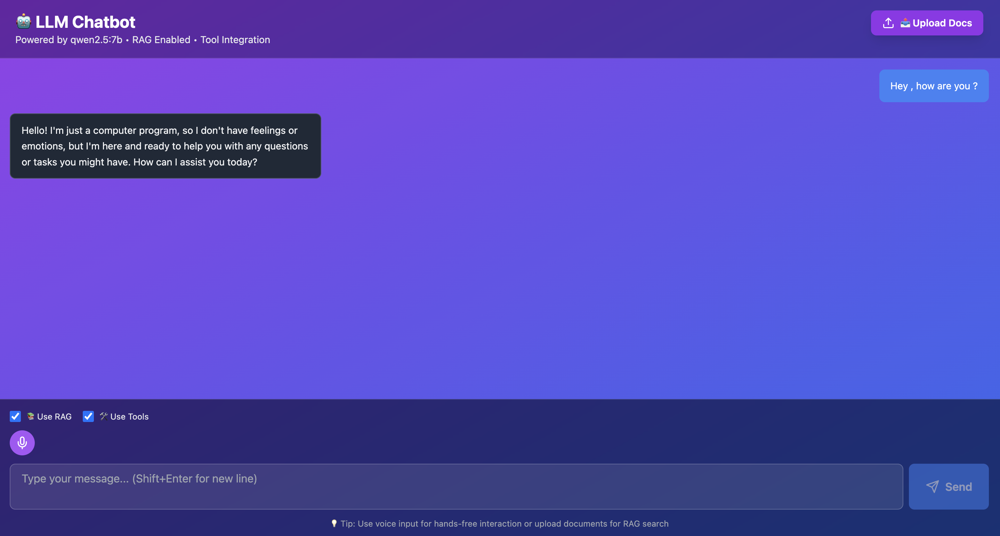

# local-llm-chatbot-system
A minimal end-to-end system that hosts a local LLM, leverages RAG for knowledge retrieval, and uses an MCP server to interact with a simple todo management backend

# Architecture design

# Quick start the all container's

- Start the todo task management service `docker compose up --build`
- The llm-chatbot service `docker compose up --build`
- Open the llm-chatbot service in the browser `http://localhost:3000`

# More details
- [Read more about todo task management service](./todoer/README.md)
- [Read more about llm-chatbot](./llm-chatbot/README.md)