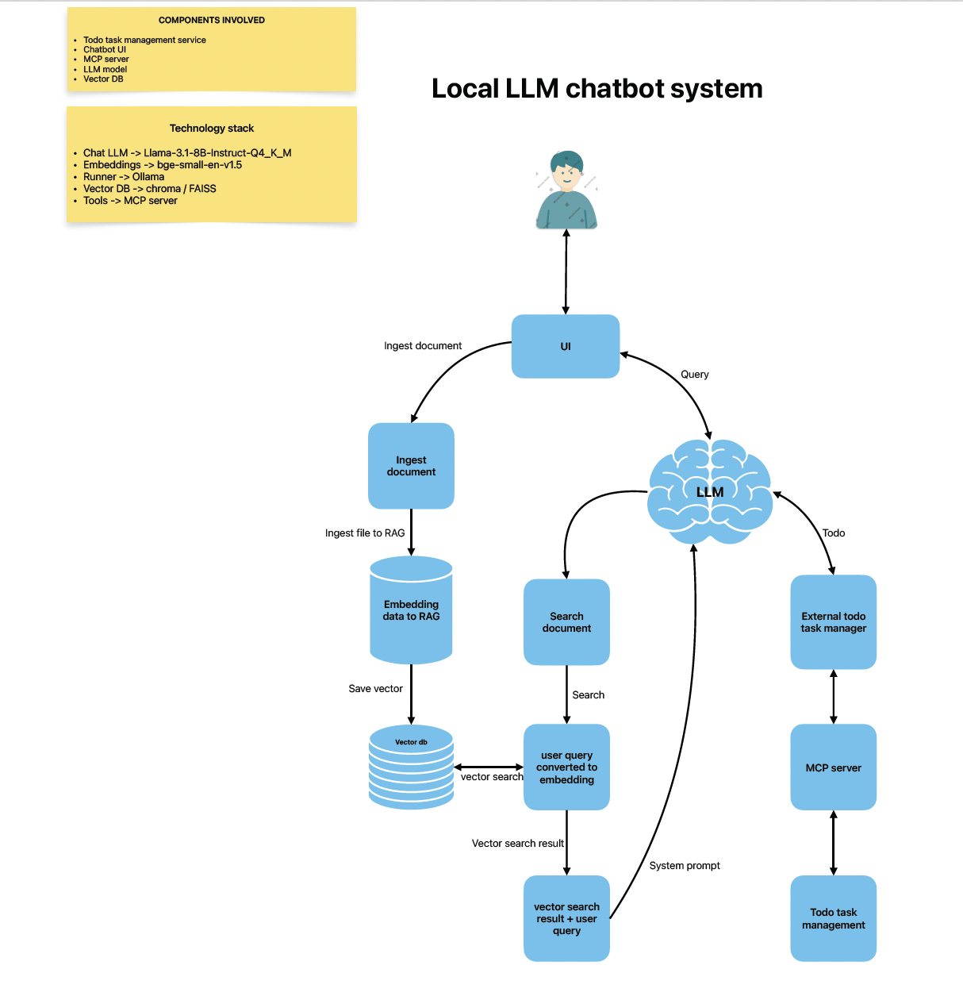

# local-llm-chatbot-system
A minimal end-to-end system that hosts a local LLM, leverages RAG for knowledge retrieval, and uses an MCP server to interact with a simple todo management backend

# Architecture design



# Quick start the all container's
```
todoer> docker compose up --build

llm-chatbot> docker compose up --build

```

# More details
- [todoer readme](./todoer/README.md)
- [llm-chatbot readme](./llm-chatbot/README.md)